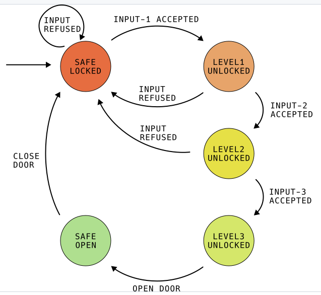

# High security safe

This repo contains the all files for the high security safe project in my school lessons.

## Project description

## Hardware List
 - Nucleo-F401RE
 - 4x4 KeyPad
 - Some Buttons, LEDs, Resistors for testing

## Block diagramm

## State machine

## Teil - Projektanforderung

# Entsperrung mit einem RFID Chip

Es gelten folgende Anforderungen.
- Der RFID Chip ist die letzte Stufe der Entriegelung.
- Nur Chips mit bestimmten IDs sollen die Entsperrungzulassen.
- Wird ein falscher Chip for den Leser gehalten soll dies mit einem Piepser signalisiert werden.